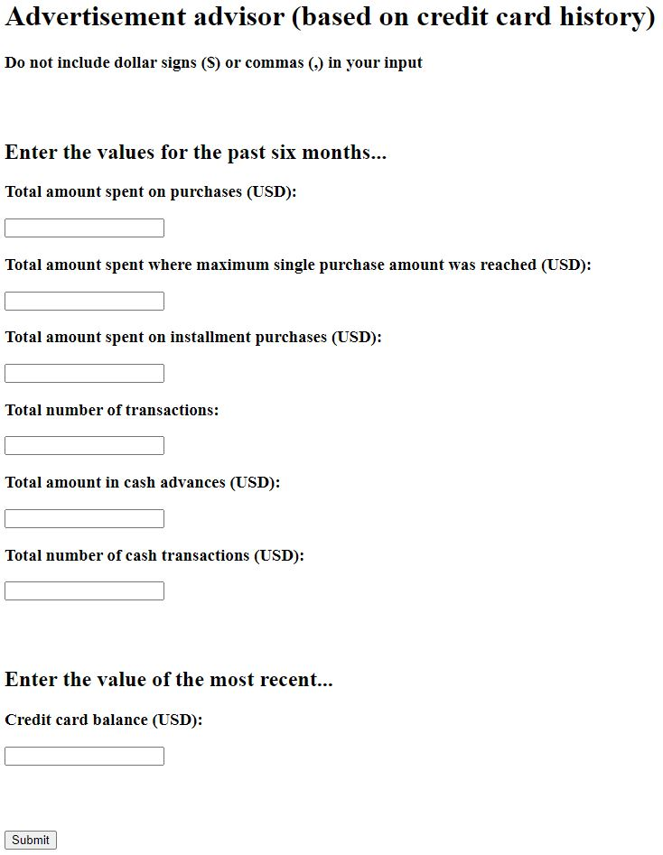

# credit Card Users Cluster Analysis App (Python/HTML)

This repository is for hosting the files used to build the [Heroku web app](https://ad-advisor.herokuapp.com/) based on [the analysis and models built on a vehicle sales dataset](https://github.com/MichaelBryantDS/credit-card-cluster). An image of the front end is displayed in Figure 1. Below you will find an overview of the code and files.

<div align="center">
  
<figure>
<br/>
  <figcaption>Figure 1: Front end of application using the two models to predict credit card clusters to advise how to advertise to the users.</figcaption>
</figure>
<br/><br/>
  
</div>

### Code Used 

**Python Version:** 3.8.11 <br />
**Packages:** pandas, numpy, scipy, sklearn, flask, pickle<br />
**For Web Framework Requirements:**  ```pip install -r requirements.txt```  

## Files

### templates/index.html

This file contains the HTML code used for the front end of the app hosted with Heroku.

### Procfile

This file contains the commands for running the application's containers. It specifies the application server as Gunicorn.

### app.py

This file contains the flask actions and input manipulation performed for the application.

### scaler_purchases.pkl

This file is the pickle containing the MinMaxScaler for the purchases clusters after it had been fit to the training data so that it can transform the user input.

### scaler_cash.pkl

This file is the pickle containing the MinMaxScaler for the cash advance clusters after it had been fit to the training data so that it can transform the user input.

### random_forest_model.pkl

This file is the pickle containing the hyperparameter tuned RandomForestClassifier model for the purchases clusters after being trained on the training data so that it can be applied to the user input.

### knn_model.pkl

This file is the pickle containing the hyperparameter tuned kNeighborsClassifier for the cash advance clusters after being trained on the training data so that it can be applied to the user input.

## Resources

1. [Kaggle: Credit Card Dataset](https://www.kaggle.com/arjunbhasin2013/ccdata)
